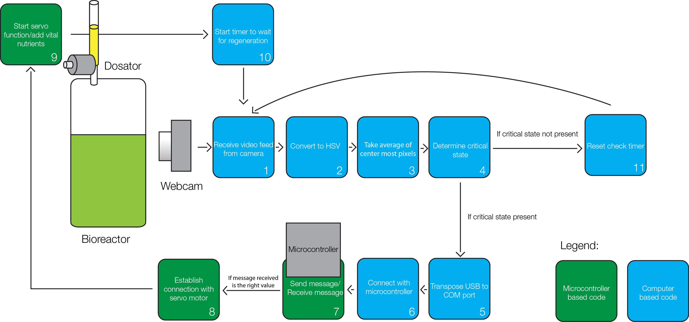

# 

AlgEYE is a system that automatically monitors algal growth and controls hydrogen production. Green algae is known to produce hydrogen gas under anaerobic states influenced by sulfur depletion, however this can have negative long term repercussions on the algae. By creating a system that automatically regulates the sulfur levels, hydrogen production is not sacrificed to algal nutrient starvation.

*See the [full report](https://github.com/georgeutsin/AlgEYE/media/report.pdf) for more information.*

## Install

Used OpenCV 2.4.2 on Visual Studio C++ 2010. Just open the project in the AlgEYE folder to run.

Be sure to properly set up OpenCV in Visual Studio 2010, by including the necessary PATH variables. Project works on standard OpenCV setup.
A tutorial on how to do this can be found [here](http://docs.opencv.org/2.4/doc/tutorials/introduction/windows_visual_studio_Opencv/windows_visual_studio_Opencv.html)

Also, modify line 25 and 152 of AlgEYE.cpp to adjust to your COM port and baud rate as all communication with the hardware is through serial.

As well, use Atmlet Studio to push the MicroEYE project to your Atmel based microcontroller. 

## Usage

Run the OpenCV application with the Atmel Microcontroller attached. Point the red boxes in the webcam window at the bioreactors to track their health. See demo video:

## Serial API

#### Computer to Microcontroller
##### Move Servo and Read Temperature

Value: `1`
Type: `char` 

Sending a 1 to the microcontroller moves the servo to add nutrients and sends back a char buffer that is the current temperature at the sensor.

##### Read Temperature

Value: `0`
Type: `char`  

Sending a 0 to the microcontroller makes the hardware reply with the current temperature, sent in a character buffer. 

## License

MIT © [George Utsin](http://georgeutsin.com)